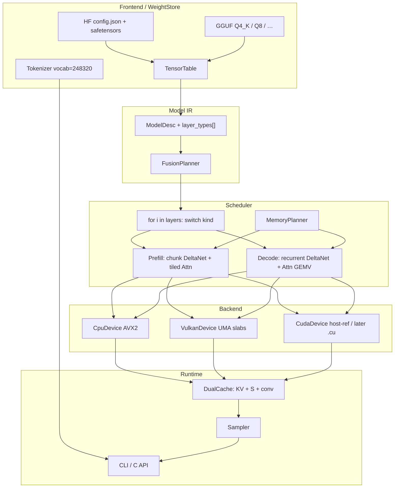
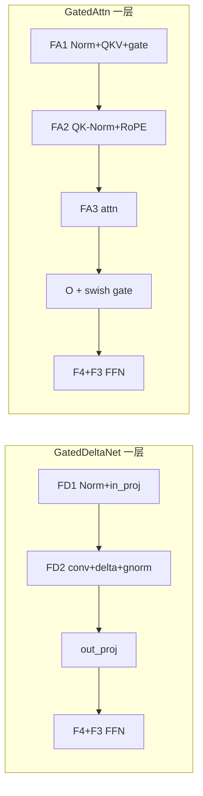
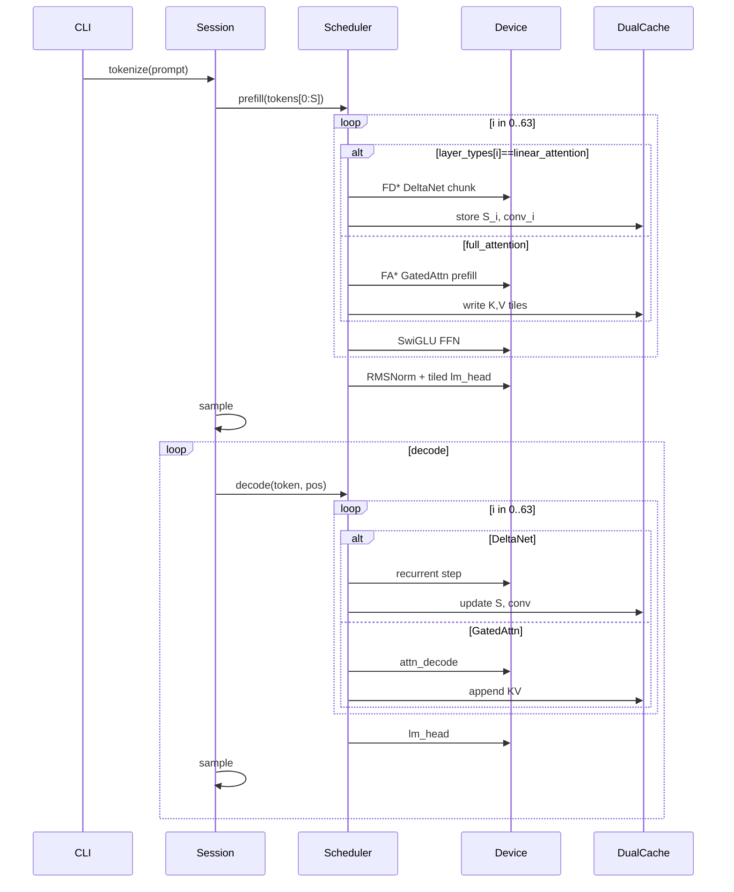

# RapidLLM：面向 Qwen3.6-27B-FP8 的自研混合架构推理引擎

| 字段 | 内容 |
| --- | --- |
| 文档标题 | RapidLLM Architecture & Development Plan |
| 作者 | TBD |
| 日期 | 2026-08-13 |
| 修订 | Rev 5 — MIT；默认 ctx 32K；bench 关 thinking；v1 仅 x86-64 |
| 状态 | 已落盘 |
| 仓库路径 | `docs/architecture.md`（与 `docs/设计方案.md` 同步） |
| 语言 | **C++20 唯一实现语言**（核心 / 后端 / kernel / loader / tokenizer / CLI / C ABI）。Python 仅测试 / 导出 / 微基准 / golden。无 Rust、无 Python 运行时。 |
| 目标平台 | **Windows x86-64 + Linux x86-64**。无 ARM / Apple Silicon。 |
| 日常开发机 | Windows + iGPU（无独立 NVIDIA GPU）+ CPU SIMD |
| 模型权重许可 | Apache-2.0（官方模型卡） |
| 引擎许可 | **MIT** |

---

## Overview

RapidLLM 是从零实现的本地推理引擎，目标是在**没有独立 NVIDIA GPU** 的 Windows 日常机上，用 CPU SIMD 与 iGPU Vulkan 跑通 **Qwen3.6-27B** 的**文本路径**，并在后续用同一套算子语义接入 CUDA。它不是 llama.cpp / vLLM / MLC 的包装层。

v1 黄金**架构**钉死为 **Qwen3.6-27B 混合**（`Qwen3_5ForConditionalGeneration` / `model_type=qwen3_5`）：64 层按 `layer_types[]` 以 3:1 交错 **48 层 Gated DeltaNet + 16 层 Gated Attention**。v1 **只跑 language model**；视觉与 MTP 进 IR 但不实现。

v1 **两种一等权重文件**（加载后变成同一套 `ModelDesc` + `TensorTable`，后端不再关心来源）：

| 路径 | 入口 | 用途 |
| --- | --- | --- |
| 官方 FP8 | `Qwen/Qwen3.6-27B-FP8` 目录：`config.json` + safetensors | 正确性金标 vs HuggingFace |
| 社区 GGUF | `*.gguf`（Q4_K / Q5_K / Q6_K / Q8_0 / 出现的 IQ 类型） | CPU 带宽路径；32 GB 机主路径 |

CLI：`rapidllm -m model.gguf` 与 `rapidllm -m /path/to/Qwen3.6-27B-FP8/` 必须都能聊。

性能命题分两层：

1. **短 decode 仍是权重带宽问题**——扫一遍 22–30 GB 的线性权重。
2. **长上下文是混合架构的胜场**——KV 只存在于 16/64 层（64 KiB/token FP16），其余 48 层是 O(1) 的 FP32 循环状态（约 150 MB，与序列长度无关）。

引擎以 **Model Description IR** 描述 `layer_types[]`，调度器按层种类分发；Qwen3-32B 稠密、Qwen2.5 等是后续 IR 近邻，不是第一交付物。

---

## Background & Motivation

### 为什么自研

日常机只有共享内存 iGPU。现成方案与本项目不对齐：

- **llama.cpp / ggml**：GGUF **文件格式与公开 block 布局**是 v1 一等输入；不 link、不 fork、不复制 `.c`。官方正确性仍以 HF FP8 为准。
- **vLLM / SGLang**：已有 Qwen3.5/3.6 kernel（含 FLA DeltaNet）。热路径在 Python + CUDA，无法作为「无 NVIDIA 卡的 Windows」开发主路径。
- **KTransformers**：CPU–GPU 异构可学，但是包装栈。
- **flash-linear-attention / mamba-ssm**：DeltaNet chunk/recurrent 的算法来源，只吸收公式，不链进产品。

RapidLLM 要拥有：混合 IR、双格式 `WeightStore`（HF FP8 + GGUF）、双缓存（KV + recurrent + conv）、block-FP8 与 Q4_K/Q5_K/Q6_K/Q8 GEMV、Gated DeltaNet CPU SIMD、UMA Vulkan、无设备 CUDA 接口。

### 当前状态

`F:\workprj\RapidLLM` 仅有 `.git`。本文是创始架构；Rev 1 曾把 Qwen3-32B 稠密当作 v1，**已被用户否决**。

### 痛点

1. **官方 FP8 文本权重 ≈ 27–30 GB 常驻**。32 GB 机器装不下官方格式；**GGUF Q4_K（约 16–20 GB）或 FP8→PackedInt4 repack** 是 32 GB 生存路径。64 GB 才舒服跑官方 FP8。
2. **CPU 没有原生 FP8**：正确性路径是 block-FP8 在线 dequant；带宽路径是 **原生 GGUF Q4_K GEMV** 或离线 PackedInt4。
3. **Gated DeltaNet 是 v1 关键路径**，不是预留枚举。没有它就没有这颗模型。
4. **`lm_head` 是 BF16 的 5120×248320 ≈ 2.37 GiB**，每 token 扫一遍，decode 带宽里不可忽视。
5. **本机无法跑 CUDA kernel**：CUDA 必须无设备可编译、host-ref 可测。
6. **iGPU `maxMemoryAllocationSize` 通常只有数 GB**：禁止分配单块 28 GB `VkDeviceMemory`。

---

## Goals & Non-Goals

### Goals（v1 must）

- 在 **CPU SIMD（AVX2，可选 AVX-512）** 上正确跑通 Qwen3.6-27B **text-only** 的 prefill + decode。
- **一等加载官方 FP8**：`config.json` + `*.safetensors` / `model.safetensors.index.json`，正确性对拍 HF。
- **一等加载 GGUF**：Q4_K / Q5_K / Q6_K / Q8_0（及出现的 IQ）；映射到同一 `ModelDesc`；缺 DeltaNet / `layer_types` 时 fail-fast。
- 加载后后端只看见 `TensorTable`。可选 **PackedInt4** repack（从 FP8 或从未知 k-quant 一次 dequant）。
- 双缓存：16 层 Gated Attention 的 KV；48 层 DeltaNet 的 FP32 recurrent state + conv1d state。
- 同一套 `Device / Buffer / Stream / Kernel` 抽象；CPU 为默认 decode 设备。
- **MemoryPlanner** 按 RAM / iGPU heap / `maxMemoryAllocationSize` 拒绝或降级。
- 正确性对拍 HuggingFace `Qwen3_5ForConditionalGeneration`（最新 transformers），`language_model_only`。
- 每个 kernel 有微基准。Windows Clang-cl 首选 + MSVC 必过；Linux CI。
- C API + CLI。C 结构在本文写出；**最小 API 在「能生成」之后版本化，不在 P3 假冻结。**

### Goals（stretch，不计入 v1 完成定义）

- Vulkan：完整混合 decode 达到 CPU 的 0.8×；prefill ≥ 1.5× CPU。
- CUDA：同卡同量化相对 llama.cpp / vLLM 达到 0.8×。
- 原生 ctx 262144；YaRN → 1.01M。
- MTP 投机解码；连续 batch。

### Non-Goals（v1 明确不做）

- 不包装 llama.cpp / ggml / vLLM / MLC / KTransformers。
- 不做 OpenAI 兼容 HTTP。
- 不做视觉编码器 / 视频预处理（IR 可描述，加载时跳过 `model.visual.*`）。
- 不做 MTP 前向（`mtp_num_hidden_layers=1` 只解析、不跑）。
- 不做 MoE 专家路径（本模型是稠密；`mlp.shared_expert_gate` 若存在则按官方 leftover 处理）。
- 不做 Qwen3-32B 稠密作为第一交付（IR 近邻，P7+）。
- 热路径不出现 Python。不自研 ISA 编译器。不引入 Rust。C ABI 用 `extern "C"`，实现文件是 `.cpp`。

---

## 目标模型钉死

### 用户已回答：Open Question 1

| 项 | 值 |
| --- | --- |
| 仓库 | [`Qwen/Qwen3.6-27B-FP8`](https://huggingface.co/Qwen/Qwen3.6-27B-FP8) |
| 架构类 | `Qwen3_5ForConditionalGeneration` |
| `model_type` | `qwen3_5` |
| 文本子配置 | `text_config.model_type = qwen3_5_text` |
| 参数量（卡片） | 27B / 列出 28B params |
| 权重许可 | Apache-2.0 |
| 官方量化 | `quant_method=fp8`, `fmt=e4m3`, `activation_scheme=dynamic`, `weight_block_size=[128,128]` |

### `text_config`（官方 `config.json`）

```text
hidden_size                 = 5120
num_hidden_layers           = 64
intermediate_size           = 17408
hidden_act                  = silu
vocab_size                  = 248320          # padded
max_position_embeddings     = 262144
rms_norm_eps                = 1e-6
tie_word_embeddings         = false
attention_bias              = false
attn_output_gate            = true
output_gate_type            = swish
full_attention_interval     = 4
layer_types                 = (linear_attention × 3 + full_attention) × 16
head_dim (full attn)        = 256
num_attention_heads         = 24
num_key_value_heads         = 4
partial_rotary_factor       = 0.25            # RoPE 作用在 64 dims
mamba_ssm_dtype             = float32
mtp_num_hidden_layers       = 1
mtp_use_dedicated_embeddings= false
```

隐藏布局（模型卡）：

```text
16 × ( 3 × (Gated DeltaNet → FFN) → 1 × (Gated Attention → FFN) )
= 48 × GatedDeltaNet + 16 × GatedAttn
```

调度器**必须**走 `layer_types[i]`，禁止写死「每 4 层」。未知 kind → 加载失败。

### Gated DeltaNet（`linear_attention`）

| 字段 | 值 |
| --- | --- |
| `linear_conv_kernel_dim` | 4 |
| `linear_key_head_dim` | 128 |
| `linear_num_key_heads` | 16 |
| `linear_num_value_heads` | 48 |
| `linear_value_head_dim` | 128 |
| `mamba_ssm_dtype` | **float32**（状态累加/存储） |

HF 参数名（来自 `modules_to_not_convert`，这些保持 BF16）：

```text
linear_attn.A_log
linear_attn.conv1d
linear_attn.dt_bias
linear_attn.in_proj_ba
linear_attn.in_proj_b
linear_attn.in_proj_a
linear_attn.norm
```

其余大投影（`in_proj_qkvz` / `out_proj` 等，以实际 safetensors 名为准）走 FP8。

维度：

```text
key_dim   = 16 × 128 = 2048
value_dim = 48 × 128 = 6144
qkvz_out  = key_dim×2 + value_dim×2 = 16384     # Q,K,V,Z
ba_out    = 48 × 2 = 96                           # β, α
conv_dim  = key_dim×2 + value_dim = 10240         # depthwise conv on Q,K,V
```

**没有 RoPE。** 位置信息来自因果 conv1d（k=4）。K 头 16 → `repeat_interleave(3)` 对齐 48 个 V 头。

### Gated Attention（`full_attention`）

| 项 | 值 |
| --- | --- |
| Q / KV | 24 / 4（GQA 6:1） |
| `head_dim` | 256 |
| RoPE | `partial_rotary_factor=0.25` → **64 dims** |
| QK-Norm | `self_attn.q_norm`, `self_attn.k_norm`（BF16，不量化） |
| 输出门 | `attn_output_gate=true`, `output_gate_type=swish` |
| QKV bias | false |

`rope_parameters`（v1 默认，**不是 YaRN**）：

```json
{
  "mrope_interleaved": true,
  "mrope_section": [11, 11, 10],
  "partial_rotary_factor": 0.25,
  "rope_theta": 10000000,
  "rope_type": "default"
}
```

`11+11+10 = 32` 个复数对 = 64 个旋转维。文本模式下三个 section 使用同一 token 位置（t=h=w=`pos`）。YaRN（`rope_type=yarn`, `factor`, `original_max_position_embeddings=262144`）仅当用户显式要超过 262144 时开启，**v1 stretch**。

### MTP 与视觉（v1 跳过）

- MTP：嵌入式 1 层，`mtp_use_dedicated_embeddings=false`。IR 记录，forward 忽略。P7 可作 draft。
- 视觉：`depth=27`, `hidden=1152`, `heads=16`, `patch=16`, `spatial_merge=2`, `temporal_patch=2`, `out_hidden_size=5120`, `gelu_pytorch_tanh`。token：`image=248056`, `video=248057`, `vision_start=248053`, `vision_end=248054`。整塔在 `modules_to_not_convert`。v1 不加载这些张量。

### Tokenizer / Chat

- 词表 **248320**（padded）。
- 默认 **thinking**。关闭：`chat_template_kwargs.enable_thinking=false`（空 think block）。
- **`preserve_thinking`**：保留历史 think 轨迹（Qwen3.6 新能力）。CLI 暴露开关。
- **官方不支持** Qwen3 的软开关 `/think` `/nothink`。不要实现为协议。

### 近邻（IR 可描述，非 v1 交付）

| 模型 | 关系 |
| --- | --- |
| Qwen3.6-27B BF16 | 同结构，权重量化不同 |
| Qwen3.5-27B | 同 `qwen3_5` 族，核对 `layer_types` 后应能加载 |
| Qwen3-32B 稠密 | 64× DenseAttn；`ArchKind::Qwen3`；P7+ |
| Qwen3-30B-A3B | MoE；专家宽 `moe_intermediate_size`（不是 `intermediate_size`） |

### 开发阶梯（取代 0.6B→8B→32B）

官方没有「迷你 Qwen3.6」。阶梯改为：

1. **合成 hybrid fixture**（必须）：2 组 = 6 DeltaNet + 2 GatedAttn，`hidden=256`, `d_k=d_v=32`, `n_v=8`, `n_k=2`, `vocab=256`。权重随机但固定 seed；用一份微型 PyTorch 参考（`python/goldens/tiny_hybrid.py`，对齐 HF 公式）出 golden。
2. **官方 27B 的前 8 层切片**（可选加速）：loader 支持 `--max-layers=8` 做数值烟测。
3. **完整 27B text-only**，MemoryPlanner 强制。

---

## 内存预算（一等约束）

### 权重：官方 FP8

嵌入与 `lm_head` **未绑定、未量化**：

```text
embed   = 248320 × 5120 × 2 B  = 2,542,796,800 B ≈ 2.37 GiB BF16
lm_head = 248320 × 5120 × 2 B  = 2.37 GiB BF16
sum     = 4.74 GiB
```

线性层（约 23–24B 参数）block-FP8 E4M3：

```text
fp8_bytes    ≈ 24.5e9 × 1 B ≈ 22.8 GiB   # 估算：28B 卡面 − embed/lm_head 2.54B；以 TensorTable.nbytes 为准
scale_bytes  ≈ (24.5e9 / (128×128)) × 4 B ≈ 5.9 MiB   # 可忽略
```

DeltaNet leftover（BF16/FP32，48 层，量级）：

```text
A_log      : 48 × 48 × 4 B            ≈ 9 KiB
dt_bias    : 48 × 48 × 4 B            ≈ 9 KiB
conv1d     : 48 × 10240 × 4 × 2 B     ≈ 3.8 MiB
in_proj_ba : 48 × 5120 × 96 × 2 B     ≈ 45 MiB
in_proj_a/b: 以 safetensors 实测为准（清单标明不转 FP8）
norms/QK   : < 20 MiB
```

**文本路径官方 FP8 常驻 ≈ 22.8 + 4.74 + leftover ≈ 27–28 GiB。**  
Planner **禁止写死 21.9/23.5e9**，必须对 `TensorTable` 求和实测 `nbytes`（再加 2 GiB pad）。社区「~22 GB」通常不含 embed/`lm_head`。

视觉塔（v1 不加载）另约 1–2 GiB BF16。整包磁盘可能到 30 GiB+。

### 权重：INT4 repack（CPU 速度路径）

```text
fp8_linears → PackedInt4   ≈ 23.5e9 × 0.5 B + scales ≈ 12.0–12.5 GiB
embed/lm_head 保持 BF16    + 4.74 GiB  → 合计 ≈ 16.8–17.3 GiB
embed INT8 + lm_head INT8  + 2.37 GiB  → 合计 ≈ 14.5–15.0 GiB
两者都 INT4                + 1.2 GiB   → 合计 ≈ 13.3–13.8 GiB
```

### 双缓存

**Gated Attention KV（16 层，随 seq 增长）：**

```text
bytes/token = 16 × 4 × 256 × 2 × sizeof
            = 32,768 × sizeof
FP16 = 64 KiB/token
INT8 = 32 KiB/token
```

| KV | 4K | 8K | 32K | 128K | 262K |
| --- | --- | --- | --- | --- | --- |
| FP16 | 256 MiB | 512 MiB | 2.0 GiB | 8.0 GiB | 16.4 GiB |
| INT8 | 128 MiB | 256 MiB | 1.0 GiB | 4.0 GiB | 8.2 GiB |

对比旧稿 Qwen3-32B 的 256 KiB/token：同 ctx 便宜 **4×**。这是混合架构的核心收益。

**DeltaNet recurrent（48 层，与 seq 无关，FP32）：**

```text
S:  48 × 48 × 128 × 128 × 4 B = 150,994,944 B ≈ 144.0 MiB
```

**conv1d state（因果 k=4，存满核宽；FP32）：**

```text
48 × 10240 × 4 × 4 B = 7,864,320 B ≈ 7.5 MiB
```

合计循环状态 ≈ **152 MiB**，相对权重可忽略，但 **decode 每步都要读+写 144 MiB 的 S**。短 ctx 下这是带宽公式里的常数项。

### 机器分档

| 档 | RAM | 推荐权重 | 默认 ctx | 说明 |
| --- | --- | --- | --- | --- |
| 不可行 | ≤16 GB | — | — | 只允许 tiny fixture |
| 最低可跑 | 32 GB | **GGUF Q4_K_M（16.8 GB）** | **32K INT8 KV（1.0 GiB）** | 16.8+1.0+0.15 state+2 pad ≈ 20 GiB，余量给 OS/iGPU。官方 FP8 28 GiB **拒绝**。可用 `--ctx` 再降。 |
| **推荐** | **64 GB** | **官方 FP8 或 GGUF Q4_K/Q5_K** | **32K**（INT8 KV 1 GiB 或 FP16 2 GiB） | FP8 + 32K + state + OS/iGPU 仍有余量 |
| 舒适 | 96–128 GB | FP8，可选 BF16 金标子集 | 32K–128K | 262K 需 INT8 KV（8 GiB） |
| 原生 262K | ≥96 GB | INT4 或 FP8 | 262K INT8 | YaRN 1M = stretch，不进 v1 |

v1 **出厂默认 `max_context = 32768`**（thinking 工作区）。`MemoryPlanner` 若 32K + 所选权重装不下则缩短或拒载（32 GB + 官方 FP8 必拒）。CLI `--ctx` 可再降。262K 是能力上限，不是默认。`rapidllm bench` 测 tok/s 时 **`enable_thinking=false`**，避免思维链淹没吞吐。

`lm_head` 2.37 GiB BF16 每 token 必扫：要么分块 GEMV（列 tile=4096），要么加载时量化。Planner 把 `lm_head` 单独列一行。

### MemoryPlanner 规则

1. 探测物理内存、可用内存、Vulkan `heapSize`、`maxMemoryAllocationSize`、`maxMemoryAllocationCount`。
2. `need = sum(TensorTable.nbytes) + kv(ctx,dtype) + recurrent(152MiB) + scratch + 2GiB pad`。权重项用实测字节，不用 23.5e9 估算。
3. 超预算依次：缩短 ctx → KV INT8 → 拒绝官方 FP8 并建议 GGUF Q4_K 或 `--repack=int4` → 硬失败（打印数字，不让 OS kill）。
4. Vulkan：若 `ceil(weights / slab)` > `maxMemoryAllocationCount` 或 slab 无法 `DEVICE_LOCAL\|HOST_VISIBLE`，**拒绝 Vulkan，权重留 CPU**。

---

## Proposed Design

### 分层

```text
┌──────────────────────────────────────────────────────────────┐
│  Serving:  versioned C API  +  CLI                           │
├──────────────────────────────────────────────────────────────┤
│  Runtime:  Tokenizer · Sampler · DualCache · MemoryPlanner   │
├──────────────────────────────────────────────────────────────┤
│  Scheduler: walk layer_types[] · Prefill / Decode            │
│             FusionPlanner (--fuse=off)                       │
├──────────────────────────────────────────────────────────────┤
│  Graph / Model IR: ModelDesc · LayerDesc[i].kind             │
├──────────────────────────────────────────────────────────────┤
│  Frontend: WeightStore = HF FP8 safetensors  ⊕  GGUF（均为 v1）│
├──────────────────────────────────────────────────────────────┤
│  Backend: Device · Buffer · TensorView · Stream · Kernel     │
│           CPU SIMD  |  Vulkan (slabs)  |  CUDA (device-less) │
└──────────────────────────────────────────────────────────────┘
```



### 仓库布局（提议，当前不存在）

```text
RapidLLM/
  CMakeLists.txt
  cmake/{RapidSIMD,RapidVulkan,RapidCUDA,CompilerWarnings}.cmake
  include/rapidllm/
    api.h                      # C API + RAPIDLLM_API_VERSION
    ir/{model_desc,quant,fp8_block,gguf_types}.h
    frontend/{weight_store,loader,hf_safetensors,gguf,repack,name_map}.h
    runtime/{session,dual_cache,sampler,tokenizer,memory_planner,thread_pool}.h
    backend/{device,buffer,tensor_view,stream,kernel,params}.h
    backend/{cpu,vulkan,cuda}/
  src/
    api/rapidllm_c.cpp          # extern "C"，实现为 C++
    cli/main.cpp
    ir/
    frontend/weight_store.cpp frontend/hf_safetensors.cpp
    frontend/gguf_loader.cpp frontend/name_map.cpp frontend/repack_int4.cpp
    runtime/ scheduler/
    backend/cpu/ backend/vulkan/ backend/cuda/
    kernels/
      ref/          # FP32 标量金标，含 gated_delta_recurrent / chunk
      cpu/          # Highway
      vulkan/ cuda/
  shaders/          # GLSL → 离线 SPIR-V
  python/goldens/{tiny_hybrid.py,gen_goldens_hf.py}
  python/export/    python/benches/
  tests/{unit,goldens,e2e,fixtures/tiny_hybrid/}
  benches/{bench_bandwidth,bench_gemv,bench_deltanet,bench_decode}.cpp
  tools/{compile_shaders.py,dump_model_ir.cpp}
  third_party/highway/
  .github/workflows/{ci-windows,ci-linux,ci-cuda-optional}.yml
```

不引入 ggml / llama.cpp / FLA / mamba-ssm 源码。

---

## Model IR（v1 一等：GatedDeltaNet + GatedAttn）

**一种 LayerKind，一层一种 token-mixer + 必带 FFN。** 禁止「一层拆两个 kind」与「DenseAttn + 预留 DeltaNet」混写。

```cpp
// include/rapidllm/ir/model_desc.h
namespace rapidllm {

enum class ArchKind { Qwen35Hybrid, Qwen3Dense, Qwen2Dense };
enum class LayerKind { GatedDeltaNet, GatedAttn, DenseAttn /* neighbor */ };
enum class ActKind { SiLU };
enum class RopeKind { None, PartialMrope, Yarn };
enum class QuantKind {
    F32, F16, BF16,
    FP8_E4M3_B128,          // 官方 HF
    PackedInt4,             // 离线 repack
    Q8_0, Q4_K, Q5_K, Q6_K, // GGUF 一等
    IQUnknown               // 已识别但无专用 kernel → 一次 dequant
};
enum class DType { F32, F16, BF16, F8_E4M3, I8, I32, Q4K, Q5K, Q6K, Q8_0 };

struct EmbeddingDesc {          // gather，不是 GEMM
    int vocab = 0, hidden = 0;
    QuantKind quant = QuantKind::BF16;
    std::string weight_name;    // model.embed_tokens.weight
};

struct LinearDesc {
    int rows = 0, cols = 0;
    bool bias = false;
    QuantKind quant = QuantKind::FP8_E4M3_B128;
    int block_m = 128, block_n = 128;
    std::string weight_name;
    std::string scale_name;     // weight_scale_inv
};

struct RopeDesc {
    RopeKind kind = RopeKind::PartialMrope;
    float theta = 1e7f;
    float partial_factor = 0.25f;     // rotary_dim = head_dim * factor
    bool mrope_interleaved = true;
    int mrope_section[3] = {11, 11, 10};
    float yarn_factor = 1.f;
    int original_max_pos = 262144;
};

// 大投影（FP8 / Q4_K 可量化）vs leftover 向量（必须 F16/BF16/F32）
struct DeltaNetLargeGemm {
    LinearDesc in_proj_qkv;   // HF Qwen3.5: 5120 → 10240 (Q+K+V)；或旧名 in_proj_qkvz
    LinearDesc in_proj_z;     // 5120 → 6144
    LinearDesc out_proj;      // 6144 → 5120
};
struct DeltaNetLeftover {
    // 秩-1 / 小矩阵，禁止 Q4/Q8
    std::string a_log;        // [48] F32
    std::string dt_bias;      // [48] F32
    std::string conv1d;       // [10240, 4] depthwise
    std::string norm;         // [128] gated RMSNorm γ
    LinearDesc in_proj_a;     // 5120 → 48
    LinearDesc in_proj_b;     // 5120 → 48
    LinearDesc in_proj_ba;    // 可选；Qwen3-Next 融合式，本模型通常拆成 a/b
};
struct DeltaNetDesc {
    int n_k_heads = 16, n_v_heads = 48;
    int k_dim = 128, v_dim = 128;
    int conv_k = 4;
    DeltaNetLargeGemm gemm;
    DeltaNetLeftover leftover;
};

struct GatedAttnDesc {
    int n_q = 24, n_kv = 4, head_dim = 256;
    bool qk_norm = true;
    bool output_gate = true;          // HF: packed in q_proj, applied as sigmoid
    LinearDesc wq;                    // rows = 24*256*2（含 gate）
    LinearDesc wk, wv, wo;
};

struct MlpDesc {
    ActKind act = ActKind::SiLU;
    LinearDesc gate, up, down;        // 名称以 safetensors 为准
};

struct LayerDesc {
    LayerKind kind = LayerKind::GatedDeltaNet;
    float rms_eps = 1e-6f;
    DeltaNetDesc delta;               // kind==GatedDeltaNet
    GatedAttnDesc attn;               // kind==GatedAttn
    MlpDesc mlp;
};

struct ModelDesc {
    ArchKind arch = ArchKind::Qwen35Hybrid;
    int vocab = 248320, hidden = 5120, n_layers = 64;
    int max_pos = 262144;
    bool tie_embed = false;           // 本模型 false；近邻 0.6B 需要 alias
    bool language_only = true;
    RopeDesc rope;
    EmbeddingDesc embed;
    LinearDesc lm_head;               // 输出投影，可分块
    std::vector<LayerDesc> layers;    // size==n_layers，与 layer_types 对齐

    // 全局层号 i ∈ [0,63] → 该 kind 的紧凑下标（0..15 attn / 0..47 delta）
    int mixer_slot(int i) const;
    LayerKind kind_of(int i) const { return layers.at(i).kind; }
};

} // namespace rapidllm
```

加载：读 `text_config.layer_types[i]`（HF）或 GGUF 探测结果 → `linear_attention`⇒`GatedDeltaNet`，`full_attention`⇒`GatedAttn`。未知字符串 fail-fast。`tie_embed==true` 时 `lm_head` 与 `embed` 共享 buffer（近邻用）。

---

## WeightStore：GGUF 与官方 FP8 均为 v1 一等

加载层是唯一知道「文件从哪来」的地方。之后 scheduler / backend / kernel 只看见 `rapidllm::TensorTable`。

```text
GGUF file   ──► GgufLoader ──────────┐
HF FP8 dir  ──► Fp8SafetensorsLoader ─┼──► TensorTable
                                      └──► optional Repack
                                           (block-FP8 → PackedInt4
                                            或未知 k-quant → Q8/F32 再 GEMV)
```

```cpp
// include/rapidllm/frontend/weight_store.h
namespace rapidllm {

enum class SourceKind { HfFp8Dir, GgufFile };

struct TensorDesc {
    std::string ir_name;          // 统一 IR 名，如 blk.3.attn.wq
    std::string src_name;         // 文件内原名
    QuantKind quant = QuantKind::BF16;
    int64_t shape[4]{};
    int ndim = 0;
    uint64_t nbytes = 0;
    uint64_t file_offset = 0;     // mmap
    std::string scale_name;       // FP8: weight_scale_inv；GGUF 空
    int gguf_type = -1;           // 原始 ggml_type，-1 = 非 GGUF
};

class TensorTable {
public:
    ModelDesc model;
    SourceKind source = SourceKind::HfFp8Dir;
    std::unordered_map<std::string, TensorDesc> tensors;
    const TensorDesc* find(std::string_view ir_name) const;
};

struct LoadOptions {
    int max_layers = -1;          // -1 = 全部；切片烟测用 8
    bool language_only = true;
    bool mmap = true;
    bool hugepage = false;
    bool repack_int4 = false;
    bool allow_iq_dequant = true; // 未知 IQ → 一次 dequant 到 Q8
    bool reject_quantized_leftover = true;
};

class IWeightLoader {
public:
    virtual ~IWeightLoader() = default;
    virtual TensorTable load(const std::filesystem::path& path,
                             const LoadOptions& opt) = 0;
};

// 探测：目录含 config.json → HF；*.gguf → GGUF；否则错误
std::unique_ptr<IWeightLoader> make_loader(const std::filesystem::path& path);

class WeightStore {
public:
    static WeightStore open(const std::filesystem::path& path,
                            Device& dev, const LoadOptions& opt);
    const ModelDesc& model() const;
    const TensorTable& table() const;
    TensorView view(std::string_view ir_name) const;  // 已上到 Device Buffer
};

} // namespace rapidllm
```

### HF FP8 加载器（`Fp8SafetensorsLoader`）

- 读 `config.json` 的 `text_config`（含完整 `layer_types[]`）。
- 读 `model.safetensors.index.json`，mmap 分片；跳过 `visual.*` / `mtp.*`。
- 有 `.weight_scale_inv` → `QuantKind::FP8_E4M3_B128`；缺 scale 的 FP8 权重 **失败**（禁止静默）。
- leftover 按 `modules_to_not_convert` 保持 BF16/F32。

### GGUF 加载器（`GgufLoader`）

必须自研解析（不 link ggml）：

1. magic `GGUF`、version、KV metadata、tensor 表（name / dims / ggml_type / offset）。
2. **架构探测**（官方 tag 可能尚未稳定为 `qwen3.6` / `qwen3_5`）：
   - 读 `general.architecture`、`*.block_count`、`*.embedding_length`；
   - 扫张量名前缀：`blk.N.linear_attn.*` / `blk.N.ssm_*` / `attn_norm` / `attn_q` / `output_norm`；
   - 若能重建 64 层且 **48 个 DeltaNet 块 + 16 个 Attn 块** 对得上，写入 `ModelDesc.layers`；
   - 若缺 `A_log` / `conv1d` / `in_proj*` 一类 DeltaNet 张量，或层数对不上：**fail-fast**，错误信息列出缺的名字与 `architecture=` 原值。
3. **名字映射** `frontend/name_map.cpp`：GGUF `blk.3.attn_q.weight` → IR `layers[3].attn.wq`；HF `model.language_model.layers.3.self_attn.q_proj.weight` → 同一 IR 名。两套表，一张 IR。
4. **逐张量 `ggml_type` 分发**，禁止假设整网同一 type。

### 经典 Q4_K_M 混合规则（必须按此实现探测，不得写错）

llama.cpp **Q4_K_M**（非 Unsloth Dynamic）是：

- 默认 **Q4_K**；
- **一半** 的 `attn.wv`（V 投影）与 **一半** 的 `ffn_down`（w2 / down_proj）用 **Q6_K**；
- **不是** Q5_K，**不是** `attn_output` / `wo`。

Unsloth Dynamic / IQ 变体更混（Q5_K / Q6_K / Q8_0 / IQ4_XS 等）。loader 只信 **每个 tensor 的 `ggml_type`**。

| 类型 | v1 kernel | 否则 |
| --- | --- | --- |
| Q4_K | `gemv_q4k` / `gemm_q4k` | — |
| Q5_K | `gemv_q5k` / `gemm_q5k` | — |
| Q6_K | `gemv_q6k` / `gemm_q6k` | — |
| Q8_0 | `gemv_q8` / `gemm_q8` | — |
| F16 / BF16 / F32 | 已有 f32 路径 | — |
| 其它 IQ* / 未实现 k-quant | **一次 dequant → Q8 或 PackedInt4**，再走对应 GEMV | 禁止 silently skip |

Q4_K 公开布局（自写 kernel，不复制 ggml `.c`）：`QK_K=256`；super-block 含 FP16 `d`/`dmin`、8×(6-bit scale, 6-bit min)、256×4-bit 权重。

Tokenizer：HF 用 `tokenizer.json`；GGUF 用内嵌 vocab / merges（若缺失则要求旁边放一份 tokenizer 文件）。

**v1 GGUF 黄金文件钉死**：[`unsloth/Qwen3.6-27B-GGUF`](https://huggingface.co/unsloth/Qwen3.6-27B-GGUF) **Q4_K_M = 16.8 GB**，`general.architecture = qwen35`。P0 把该文件的张量名表检入 `tests/fixtures/gguf_qwen36_27b_names.txt`；`name_map` 以该表为准。llama.cpp 若把 V 头从 grouped 打成 tiled，loader **必须反向还原**到 HF `[B,T,48,128]` 布局（在 fixture 注释里写清置换）。v1 **不做 GGUF writer**；32 GB 路径依赖这份社区文件。stretch：仅 Q8 的 `hf_fp8_to_gguf`。

**leftover 精度政策**：`A_log` / `dt_bias` / `conv1d` / DeltaNet `norm` / `q_norm` / `k_norm` / 层 RMSNorm 必须是 F16/BF16/F32。这些名字若是 Q4/Q5/Q6/Q8 → **拒绝加载**（不是 missing，是 over-quant）。

工期：双加载器相对「只做 FP8」**+1.5–2.5 人周**（P0 解析 + P2 k-quant GEMV），计入 must，不推到 v2。完整角色对照见文末 **附录 A**。

---

## Backend ABI（可实现的契约）

全部 C++ 类型在 `namespace rapidllm`。C ABI（`rapidllm.h`）是薄 `extern "C"` 包装，实现在 `src/api/rapidllm_c.cpp`。

### TensorView / Buffer / Stream / Device

```cpp
// include/rapidllm/backend/device.h
namespace rapidllm {

enum class DeviceKind { CPU, Vulkan, CUDA };

struct BufferDesc {
    size_t bytes = 0;
    enum class Usage { Weight, Activation, KV, Recurrent, Scratch, HostStaging } usage{};
    bool host_visible = false;
};

class Buffer {
public:
    virtual ~Buffer() = default;
    virtual void* host_ptr() = 0;     // CUDA device-only → nullptr
    virtual size_t bytes() const = 0;
};

struct TensorView {
    Buffer* buf = nullptr;
    DType dtype = DType::F32;
    int32_t ndim = 0;
    int64_t shape[8]{};
    int64_t stride[8]{};
    uint64_t byte_offset = 0;
    void* host_ptr() const;
};

// Stream 是隐式命令记录器（KD）：
//   launch / memcpy 只入队；
//   begin_step() 开启一段（一层或整步 decode）；
//   end_step() 结束记录但不提交；
//   synchronize() 提交并等待。
// host_ptr() 读：仅 synchronize() 之后合法。
// UMA 持久映射：CPU 写权重在第一轮 synchronize 前完成；之后 CPU 不得在 GPU 使用中写同一 slab。
class Stream {
public:
    virtual ~Stream() = default;
    virtual void begin_step(const char* tag) = 0;
    virtual void end_step() = 0;
    virtual void synchronize() = 0;
};

class Device {
public:
    virtual ~Device() = default;
    virtual DeviceKind kind() const = 0;
    virtual const char* name() const = 0;
    virtual std::unique_ptr<Buffer> allocate(const BufferDesc&) = 0;
    virtual std::unique_ptr<Stream> create_stream() = 0;
    virtual void memcpy(TensorView dst, TensorView src, Stream&) = 0;
    virtual void launch(const char* kernel, const TensorView* args, int nargs,
                        const void* params, size_t params_bytes, Stream&) = 0;
    virtual bool has_kernel(const char* name) const = 0;
};

std::unique_ptr<Device> create_device(DeviceKind k);

} // namespace rapidllm
```

Vulkan / CUDA 把 `begin_step`→`end_step` 录成 **一条 command buffer / 一张 CUDA Graph 候选**。CPU 的 begin/end 是 no-op，`launch` 当场跑（或丢进线程池）。

`--fuse=off`：FusionPlanner 输出未融合 op 序列，供 A/B 与对拍。

### Kernel 参数结构（`include/rapidllm/backend/params.h`）

```cpp
namespace rapidllm {

struct RmsNormParams { int n; float eps; };

struct GemvFp8Params {
    int m, n;                 // y[m] = W[m,n] x[n]
    int block = 128;
    int act_dynamic;          // 1 = 按行/按 token 计算 act scale
};

struct GemvKQuantParams {     // Q4_K / Q5_K / Q6_K / Q8_0 共用形状
    int m, n;
    int type;                 // QuantKind 底层值
};

struct GemvInt4Params { int m, n, group = 32; };

struct LmHeadParams {
    int hidden, vocab;
    int tile = 4096;          // 列分块
    int quant;                // 0=BF16, 1=repack
};

struct RopeParams {
    int n_q, n_kv, head_dim, rotary_dim;
    int pos;
    float theta;
    int mrope_section[3];
    int interleaved;
};

struct AttnDecodeParams {
    int n_q, n_kv, head_dim, seq, pos;
    int kv_dtype;             // 0=F16, 1=I8
    float rms_eps;
};

struct AttnPrefillParams {
    int n_q, n_kv, head_dim, seq;
    int br, bc;               // tile
};

struct Conv1dParams { int dim, k, silu; };

struct DeltaRecurrentParams {
    int n_v, dk, dv;
    float eps_l2;
};

struct DeltaChunkParams {
    int n_v, dk, dv, seq, chunk;  // chunk 默认 64
    float eps_l2;
};

struct SwiGLUParams { int hidden, intermediate; };

} // namespace rapidllm
```

### 误差约定（相对 `kernels/ref` FP32）

| Kernel | CPU 存储 | 累加 | vs ref |
| --- | --- | --- | --- |
| `rmsnorm` | F32 | F32 | maxabs < 1e-5 |
| `rope_partial_mrope` | F32 | F32 | maxabs < 2e-5 |
| `gemv_fp8` / `gemm_fp8` | F32 act | **F32** | maxabs < 5e-3（相对 BF16 权重） |
| `gemv_q4k` / `q5k` / `q6k` / `q8` | F32 act | F32 | vs ref dequant+dot maxabs < 2e-3 |
| `gemv_int4` | F32 act | F32 | 只对 repack 自洽；不对 HF greedy-exact |
| `delta_recurrent` / `delta_chunk` | **state F32** | **F32** | maxabs < 1e-4（fixture）；27B 放宽到 2e-3 |
| `conv1d_causal` | F32 | F32 | maxabs < 1e-5 |
| `attn_decode` / `prefill` | scores F32 | F32 | maxabs < 2e-3 |
| `swiglu` | F32 | F32 | maxabs < 1e-5 |
| `lm_head` | F32 logits | F32 | tile 边界 maxabs < 2e-3 |

**Greedy-exact 只适用于：FP32 激活 + FP32 累加 + 官方 BF16 leftover + FP8 按 HF 同样的 dynamic dequant。** GGUF Q4_K / PackedInt4 只报匹配率 / KL。Q8_0 GGUF 应对齐到接近 Q8 容差。

---

## 量化方案（双一等：官方 FP8 ⊕ GGUF k-quant）

### v1 一等 A：官方 block-FP8

```text
W_fp8[i,j] ∈ E4M3
scale[bi,bj] ∈ FP32          # 一块 128×128 一个 scale（HF 名常见 weight_scale_inv）
W ≈ W_fp8 * scale            # 具体乘/除以 transformers 实现为准，loader 对拍一份 128×128 金标块
activation_scheme = dynamic  # 激活不预量化；GEMM 时按 token 计算 scale，或直接 FP32 act × dequant(W)
```

`modules_to_not_convert`（文本侧，按名匹配，允许前缀）：

- `lm_head`, `model.embed_tokens`
- 每层 `input_layernorm`, `post_attention_layernorm`
- `mlp.gate`, `mlp.shared_expert_gate`（本稠密模型上是小 leftover / 命名残留，**不是** 5120×17408 的 `gate_proj`；大 FFN 矩阵以 safetensors 实际名为准，通常已 FP8）
- DeltaNet：`linear_attn.A_log|conv1d|dt_bias|in_proj_ba|in_proj_b|in_proj_a|norm`
- GatedAttn：`self_attn.q_norm`, `self_attn.k_norm`
- 全部 `model.visual.*` / `visual.*`
- 全部 `mtp.*`

未知张量：若带 `.weight_scale_inv` 按 FP8 加载，否则按 BF16。禁止静默丢 scale（SGLang 曾出现 `weight_scale_inv` 被丢导致垃圾输出）。

### v1 一等 B：GGUF Q4_K / Q5_K / Q6_K / Q8_0

与 FP8 **平行**，不是后路。热路径 **原生 super-block 在线 dequant GEMV**，禁止「先整网 dequant 成 F16 再 GEMV」作为默认。

Q4_K_M 混合规则见 WeightStore 节。kernel 按 `TensorDesc.quant` 分发：`gemv_q4k` / `gemv_q5k` / `gemv_q6k` / `gemv_q8`（及对应 GEMM）。未知 IQ / 新 type → 加载期一次 dequant 到 Q8 或 PackedInt4，打警告。

### 第三条速度路径：PackedInt4（可选 repack）

CPU / 多数 iGPU **无 FP8 张量核**。官方 FP8 可离线 repack：

- 组大小 32 或 64，非对称 INT4 + FP16 scale，64B 对齐。
- **默认内层 = AVX2 nibble expand + FP32 FMA**（不依赖 VNNI）。
- `VPDPBUSD` / AVX-512-VNNI 用 Highway 派遣，作为加速，不是默认。
- 不 repack leftover（A_log、conv、norm）。
- GGUF Q4_K **默认保持原生**（已是带宽友好布局）；仅当微基准显示 repack 明显更快才默认转。

### 明确不做（v1）

AWQ / GPTQ / MXFP4 / NVFP4 / **4-bit KV**。4-bit KV 在长思维链上有轨迹漂移风险，v1 不做（不引用未核验的单条社区数字）。

### Vulkan / CUDA 上的 FP8

- 有原生 FP8（部分 dGPU）：shader / Tensor Core 直吃 E4M3。
- 否则 shader 内 dequant 到 F16/F32。
- iGPU：按探测结果，多数走 dequant。

---

## Kernel 目录与可实现数学

### 1. RMSNorm

\[
y = \frac{x}{\sqrt{\mathrm{mean}(x^2)+\varepsilon}}\,w,\quad \varepsilon=10^{-6}
\]

### 2. block-FP8 GEMV / GEMM

对输出行 \(i\)、输入 \(x\in\mathbb{R}^{n}\)（FP32）：

```text
acc = 0
for bj in 0..n/128:
    s = scale[i/128, bj]
    for j in block:
        acc += float(W_e4m3[i, j]) * s * x[j]
y[i] = acc
```

Dynamic act：可选先对 \(x\) 求 maxabs 再rescale；v1 CPU **默认 FP32 act、不量化激活**（与「dynamic」兼容：等价于 act_scale=1 的精确路径）。Vulkan/CUDA 可启用 dynamic 以吃 FP8 MMA。

### 3. PackedInt4 GEMV

AVX2：16 个 nibble → `u8` 表扩展 → `i32`/`f32` FMA。组 scale 在寄存器。

### 3b. GGUF k-quant GEMV（Q4_K / Q5_K / Q6_K / Q8_0）

对每个 super-block（Q4_K：`QK_K=256`）在寄存器 dequant 并立刻与激活 FMA。Q5_K / Q6_K 用各自公开 block 布局（更多 scale 比特）。Q8_0：32 元一组，`d`（FP16）× int8。按行切给 `WorkerPool`。金标：`kernels/ref` 先 dequant 再点积。

### 4. 因果 conv1d（k=4, depthwise, +SiLU）

Prefill：标准 padded conv。  
Decode：滑动窗 `state[dim, 4]`，新样本推进，点积 4 个 tap，SiLU。

```text
conv_dim = 10240
y[c] = silu( Σ_{t=0..3} w[c,t] * window[c,t] + bias[c] )
```

### 5–6. Gated DeltaNet — **HF 锁定**（`Qwen3_5GatedDeltaNet`）

**金标优先级：HuggingFace `transformers` 里实际加载本模型的模块。**  
当前即 `src/transformers/models/qwen3_5/modular_qwen3_5.py` 的 `Qwen3_5GatedDeltaNet`，复用 `qwen3_next` 的 `torch_recurrent_gated_delta_rule` / `Qwen3NextRMSNormGated`。  
**若本文与 HF 漂移，以 HF 为准。** 禁止用 FLA 默认值覆盖 HF。

#### 5.1 投影（Qwen3.5 拆分式，不是 Next 的 qkvz+ba）

```text
mixed_qkv = in_proj_qkv(x)     # [B,T,10240] = Q 2048 + K 2048 + V 6144
z         = in_proj_z(x)       # [B,T,6144] → [B,T,48,128]
b         = in_proj_b(x)       # [B,T,48]
a         = in_proj_a(x)       # [B,T,48]
mixed_qkv = causal_conv1d(mixed_qkv, conv1d, k=4) + SiLU   # 只卷 QKV，不卷 z
Q,K,V     = split(mixed_qkv)
Q = reshape(..., 16, 128); K 同；V = (..., 48, 128)
Q = repeat_interleave(Q, 3, dim=heads)   # 16 → 48
K = repeat_interleave(K, 3, dim=heads)
β = sigmoid(b)
g_log = -exp(A_log) * softplus(a + dt_bias)   # 传入 kernel 的 g，仍是 log 域
```

#### 5.2 `torch_recurrent_gated_delta_rule`（decode **与** v1 must prefill）

HF 在 kernel 内（`use_qk_l2norm_in_kernel=True`）：

```text
q = l2norm(q);  k = l2norm(k)          # dim=-1, eps=1e-6
scale = 1 / sqrt(d_k)                  # d_k = 128；HF **会**乘这个系数
q = q * scale                          # 此后读出不再除 √d
# 对每个 t（g_t = exp(g_log[t])）：
S = S * g_t                            # S: [H, dk, dv]
kv_mem = (S * k_t[..., None]).sum(-2)  # [H, dv]
delta  = (v_t - kv_mem) * β_t
S = S + k_t[..., None] * delta[..., None, :]
o_t = (S * q_t[..., None]).sum(-2)     # 已含 1/√d
```

**结论：`1/√d` 在 kernel 里乘到 q 上，gated RMSNorm 之前。不要再除一次。**

#### 5.3 `gated_rmsnorm` = `Qwen3NextRMSNormGated`（先 Norm 再门）

\[
\mathrm{gated\_rmsnorm}(x,z)=\gamma\odot\frac{x}{\sqrt{\mathrm{mean}(x^{2})+\varepsilon}}\odot\mathrm{SiLU}(z)
\]

\(\varepsilon=10^{-6}\)，\(\gamma\) 初始化为 1。**不是** `RMSNorm(x * SiLU(z))`。

4 维数值例（\(\gamma=1,\varepsilon=0\) 便于手算）：

```text
x = [3, 0, 4, 0]     mean(x²)= (9+0+16+0)/4 = 6.25,  rms=2.5
n = x/2.5 = [1.2, 0, 1.6, 0]
z = [0, 0, 0, 0]     SiLU(0)=0
out = n * 0 = [0,0,0,0]

z = [10, 10, 10, 10] SiLU(10)≈10
out ≈ [12, 0, 16, 0]
```

然后 `out_proj`。

#### 5.4 Prefill：v1 must = 逐步 recurrent；chunk = stretch

P1 退出只要求 `delta_recurrent` 与 HF 逐步循环一致（S=1 与 S=N 最终 state 相同）。  
**27B S=8K prefill 用逐步扫描，允许慢**（数量级：48 层 × 8K × 48 头 × 128² FMA，约几十秒级，写进 CLI 提示）。  
`delta_chunk`（HF `torch_chunk_gated_delta_rule`，内部 **同样** `q *= 1/√d`）是 stretch，不挡 P1/P3。P4+ 再把 27B 默认切到 chunk。

### 7. Gated Attention（`Qwen3_5Attention` = `Qwen3NextAttention`）

```text
# q_proj 输出 24*256*2，后一半是 gate（没有独立 w_gate 大矩阵）
Q_gate = q_proj(x);  Q, gate = split_last(Q_gate, 2)
K = k_proj(x);  V = v_proj(x)
Q = qwen3_rms_head(Q); K = qwen3_rms_head(K)
  # Qwen3NextRMSNorm: y = (x / rms(x)) * (1 + γ), γ 初始化 0
RoPE_partial 前 64 维；mRoPE [11,11,10]
scores = Q K^T / √256          # GQA repeat 6
Y = softmax_causal(scores) V
Y = Y * sigmoid(gate)          # HF 源码是 sigmoid，不是 config 字符串 swish
O = o_proj(Y)
```

config 的 `output_gate_type=swish` **当前 transformers 类未读取**。实现跟 HF 类；若上游改读 config，再跟代码。

Prefill：Flash 风格 tiling（Br/Bc），不物化 \(S\times S\)。Decode：GEMV + online softmax，读 INT8/FP16 KV。

### 8. SwiGLU FFN

```text
h = silu(gate_proj(x)) * up_proj(x)     # 5120 → 17408
y = down_proj(h)
```

F3：gate/up 写出后立刻 SiLU*，不落 17408×2 的中间盘。

### 9. `lm_head`

`5120 × 248320` BF16。Decode：按列 tile=4096 做 GEMV，可选加载期 INT8/INT4。Bench 单列 `bench_lm_head`。

### Kernel 注册名（三后端同名）

| 名字 | 阶段 |
| --- | --- |
| `rmsnorm` | P1 |
| `rope_partial_mrope` | P1 |
| `qk_norm` | P1 |
| `gemv_f32` / `gemm_f32` | P1 |
| `conv1d_causal` / `conv1d_update` | P1 |
| `l2norm` | P1 |
| `delta_recurrent` | P1 must（decode + prefill） |
| `delta_chunk` | P4+ stretch |
| `gated_rmsnorm` | P1 |
| `attn_prefill` / `attn_decode` | P1 |
| `swiglu` / `swiglu_fused` | P1/P2 |
| `gemv_fp8` / `gemm_fp8` | P2 |
| `gemv_q4k` / `gemv_q5k` / `gemv_q6k` / `gemv_q8` 及 GEMM | P2 |
| `gemv_int4` / `gemm_int4` | P2 |
| `lm_head_tiled` | P2 |
| `sample_*` | P3 |

---

## 融合组（混合架构重做）

| ID | 融合 | 减往返 | 阶段 |
| --- | --- | --- | --- |
| **FD1** | DeltaNet：`RMSNorm + in_proj_* + split` | 少写 hidden / 大投影输入 | P4 |
| **FD2** | `conv1d+SiLU + l2norm + gates + recurrent/chunk + gated_rmsnorm` | 状态与 qkv 留在 L2/寄存器 | P4；P1 可先拆开 |
| **FD3** | `out_proj` 紧挨 FD2（可选） | | P4 |
| **FA1** | GatedAttn：`RMSNorm + q_proj(含 gate)/k/v` 三次 GEMV | 少写 hidden | P4 |
| **FA2** | `QK-Norm + partial RoPE` | 寄存器 | P4 |
| **FA3** | decode attn online-softmax | 不物化 scores | P3–P4 |
| **F3** | `SiLU(gate)*up` | 少写 2×17408 | P2 |
| **F4** | `residual + 下一 RMSNorm` | | P4 |
| **F7** | `final RMSNorm + tiled lm_head` | | P4 |

`--fuse=off` 强制拆开。不做整模型 mega-kernel（Vulkan/CUDA 不强制）。



---

## 调度与 DualCache

v1 单序列。



`DualCache`（**连续分配**，不是 paged；paged 是 P7）：

```cpp
// include/rapidllm/runtime/dual_cache.h
namespace rapidllm {

class DualCache {
public:
    DualCache(Device& dev, const ModelDesc& m, int max_pos, DType kv_dtype);
    TensorView k(int full_attn_index);
    TensorView v(int full_attn_index);
    TensorView state(int delta_index);   // [n_v, dk, dv] F32
    TensorView conv(int delta_index);    // [conv_dim, k] F32
    void append_kv(int full_attn_index, TensorView k_t, TensorView v_t, int pos, Stream&);
    void store_delta(int delta_index, TensorView s, TensorView conv, Stream&);
private:
    std::unique_ptr<Buffer> kv_;     // [16][2][n_kv][max_pos][256]
    std::unique_ptr<Buffer> state_;  // [48][48][128][128] F32
    std::unique_ptr<Buffer> conv_;   // [48][10240][4] F32
};

} // namespace rapidllm
```

图里禁止再写「Paged KV Cache」。

---

## SIMD / 线程 / Windows

- **Highway**；默认 AVX2。热 GEMV 允许手写 AVX2。
- PackedInt4 **默认 AVX2 nibble**；VNNI 可选。
- AVX-512 为 x86 stretch。**v1 不支持 ARM / Apple Silicon**；Highway NEON 是后续机会，不进 v1 CI。
- **P1 即引入静态行划分线程池**（`WorkerPool`），否则任何 %STREAM 门都无意义。P4 再做亲和、大页、预取。
- **工具链钉死（C++20）**：Windows 日常 **Clang-cl 18+ + Ninja**；CI 矩阵 **Clang-cl + MSVC 17.10**（MSVC 必过，允许 GEMV 慢 5–15%）。Linux CI：Clang 18 / GCC 13。`CMAKE_CXX_STANDARD=20`，无例外。发布二进制建议 Clang。不接受 Rust / Python runtime 替代。
- Windows：`QueryPerformanceCounter`。P-core 亲和可选 `--cores=p`。大页 `SeLockMemoryPrivilege`，失败回退。路径 UTF-16。
- mmap：safetensors **与 GGUF** 默认只读 mmap；repack 文件可 mmap。可选 `--copy-hugepage`。

---

## Vulkan（iGPU）

- Vulkan 1.2 + 离线 SPIR-V。Specialization：`WG_X`, `TILE_K`, `BLOCK=128`。
- **Slab 分配器（必须）**：
  ```text
  slab = min(256 MiB, maxMemoryAllocationSize)
  n    = ceil(weight_bytes / slab)
  if n > maxMemoryAllocationCount → 拒绝 Vulkan
  每 slab：DEVICE_LOCAL|HOST_VISIBLE 持久 map，TensorView 用 byte_offset
  ```
- 禁止单块 28 GB。
- 整步 decode 一条 CB。小 dispatch 当失败模式。
- **v1 must**：RMSNorm + FP8/INT4 GEMV 在 UMA 上对拍 fixture。完整 27B 混合 shader = stretch。
- 默认 decode 设备仍是 **CPU**。`--device=vulkan` 显式。

何时 iGPU 更可能赢：prefill（chunk GEMM + 16 层 flash attn）；长 ctx（CPU 被 KV/状态写放大）。短 decode 与 CPU 抢同一条 DRAM，目标 0.8–1.3×，不幻想 3×。

---

## CUDA（无设备）

```text
include/rapidllm/backend/cuda/cuda_device.h   # 禁止 #include <cuda_runtime.h>
src/backend/cuda/cuda_device.cpp              # 永远编译
src/kernels/cuda/cuda_ref.cpp                 # 每个 .cu 符号的 host-ref 孪生
src/kernels/cuda/stubs.cpp                    # OFF
src/kernels/cuda/*.cu                         # RAPIDLLM_WITH_CUDA=ON
```

规则：每个 `.cu` 入口必须有 host-ref，误差表同上。P6 must = OFF 构建绿 + host-ref vs CPU CI + **一台点名的远程盒 8B-等价/fixture 烟测**。0.8× llama.cpp/vLLM 是 stretch，需用户提供一晚 A10/4090（SKU 未定时标 needs-user-input，不阻塞接口 PR）。

---

## Tokenizer、采样、C API

Tokenizer：BBPE，vocab 248320，与 HF 固定语料一致。Chat template：日常 **thinking 默认开**、`enable_thinking`、`preserve_thinking`。无 `/think` 软开关。**`rapidllm bench` 与任何 tok/s 路径强制 `enable_thinking=false`。**

| 符号 | id |
| --- | --- |
| BOS / EOS (`text_config`) | **248044** |
| `vision_start` / `vision_end` | 248053 / 248054 |
| `image_token` / `video_token` | 248056 / 248057 |

v1 文本路径只使用 248044；视觉 token 解析后拒绝（language_only）。

采样预设（官方 Best Practices）：

| 预设 | temp | top_p | top_k | presence |
| --- | --- | --- | --- | --- |
| `thinking-general` | 1.0 | 0.95 | 20 | 0.0 |
| `thinking-coding` | 0.6 | 0.95 | 20 | 0.0 |
| `instruct` | 0.7 | 0.80 | 20 | 1.5 |

### C API（现在写出，P3 之后才 version freeze）

```c
/* include/rapidllm/api.h */
#define RAPIDLLM_API_VERSION 1

typedef enum RapidStatus {
    RAPID_OK = 0,
    RAPID_ERR_IO, RAPID_ERR_FORMAT, RAPID_ERR_NOMEM,
    RAPID_ERR_UNSUPPORTED, RAPID_ERR_DEVICE, RAPID_ERR_RANGE, RAPID_ERR_INTERNAL
} RapidStatus;

typedef struct RapidError {
    RapidStatus code;
    char message[256];
} RapidError;

typedef struct RapidConfig {
    const char* model_path;      /* HF 目录 或 *.gguf */
    const char* device;          /* "cpu" | "vulkan" | "cuda" */
    int threads;                 /* 0 = 物理核数 */
    int ctx;                     /* 默认 32768；planner 可下调 */
    int kv_i8;                   /* 1 = INT8 KV */
    int fuse;                    /* 1 on, 0 = --fuse=off */
    int mmap;                    /* 1 默认 */
    int hugepage;                /* 0 默认 */
    int language_only;           /* 1 默认 */
    int repack_int4;             /* 0 默认；1 = 允许/要求 repack */
} RapidConfig;

typedef struct RapidSessionConfig {
    int enable_thinking;         /* 1 默认 */
    int preserve_thinking;       /* 0 默认 */
    int max_new_tokens;
} RapidSessionConfig;

typedef struct RapidSampleParams {
    float temperature, top_p, min_p;         /* min_p 默认 0.f，与官方表一致；未暴露 CLI 时保持 0 */
    float presence_penalty, repetition_penalty;
    int top_k;
    int greedy;
} RapidSampleParams;

typedef struct RapidLogitsView {
    const float* data;           /* 主机指针，长度 vocab */
    int vocab;
    /* 生命期：直到该 session 下一次 prefill/decode/generate/free */
} RapidLogitsView;

typedef struct RapidLLM RapidLLM;
typedef struct RapidSession RapidSession;

RapidLLM*     rapidllm_load(const RapidConfig*, RapidError*);
void          rapidllm_free(RapidLLM*);
int           rapidllm_vocab(const RapidLLM*);
int           rapidllm_encode(RapidLLM*, const char* utf8, int32_t* ids, int cap, RapidError*);
int           rapidllm_decode_ids(RapidLLM*, const int32_t*, int n, char* out, int cap, RapidError*);

/* 高层：内部 prefill+循环 decode+sample。P3 先实现这个。 */
int           rapidllm_generate(RapidSession*, const int32_t* ids, int n,
                                const RapidSampleParams*, int32_t* out, int cap, RapidError*);

/* 底层（可空实现到 P3 末）： */
RapidSession* rapidllm_session_new(RapidLLM*, const RapidSessionConfig*, RapidError*);
int           rapidllm_prefill(RapidSession*, const int32_t*, int n, RapidError*);
int           rapidllm_decode(RapidSession*, int32_t token, RapidLogitsView*, RapidError*);
int           rapidllm_sample(RapidSession*, const RapidSampleParams*, int32_t* token, RapidError*);
void          rapidllm_session_free(RapidSession*);

int           rapidllm_api_version(void);   /* = RAPIDLLM_API_VERSION */
```

错误不抛过 C 边界。`RapidError.message` 有效直到下一次同线程 API 调用。`rapidllm_decode` 一次一个 token，logits **拷到主机**（view 指向 session 内部缓冲）。

P3 交付 **`load / session_new / encode / generate / session_free / free`**。底层 `prefill`/`decode`/`sample` 可以后补但头文件已有。**不在 P3 宣称 ABI 冻结**；冻结点 = 第一次打 tag，`RAPIDLLM_API_VERSION` 递增。

CLI：

```text
rapidllm-cli -m /path/to/Qwen3.6-27B-FP8 --device cpu --ctx 32768
rapidllm-cli -m Qwen3.6-27B-Q4_K_M.gguf --device cpu --ctx 32768
             --kv-i8 --threads 16 --repack=int4 --fuse=on
             --thinking --preserve-thinking=false
             --preset thinking-coding --prompt "..."
rapidllm bench -m Qwen3.6-27B-Q4_K_M.gguf   # 强制 enable_thinking=false，测 tok/s
```

---

## 性能目标

统一公式（decode）：

```text
bytes/step = weight_bytes_scanned          # FP8≈22GiB 或 INT4≈12GiB + lm_head
           + kv_read_bytes(ctx)            # 64 KiB×ctx (FP16) 或 32 KiB×ctx
           + recurrent_rw                  # ≈ 144 MiB 读 + 144 MiB 写 = 288 MiB
tok/s      = α × STREAM_measured / bytes/step
```

`STREAM_measured` = 本机 `bench_bandwidth` 多核 triad，**不是** 理论 51.2。

**例（64 GB，DDR4-3200，测得 STREAM=40 GB/s，INT4 12.5 GiB + lm_head INT8 1.2 GiB + 8K INT8 KV 0.25 GiB + 0.29 GiB state RW）：**

```text
bytes/step ≈ 12.5 + 1.2 + 0.25 + 0.29 ≈ 14.2 GiB
α=0.40 → 1.13 tok/s     # P2/P4 must 量级
α=0.55 → 1.55 tok/s     # stretch
```

官方 FP8 在线 dequant（扫 22+2.4 lm_head）：

```text
bytes/step ≈ 24.4 + 0.25 + 0.29 ≈ 25 GiB
α=0.40 → 0.64 tok/s
```

| 指标 | Must | Stretch |
| --- | --- | --- |
| Fixture greedy vs 微型 PyTorch | token 级一致 | — |
| 27B FP32-act + 官方 FP8，50 prompt greedy vs HF | 匹配率 ≥ 90% 或答案 ≥ 90%；允许量化噪声 | token 级一致（很难，不承诺） |
| INT4 27B | 匹配率 ≥ 80%，报 KL | — |
| CPU INT4 decode α | 记录数字；P4 must **有仪表** | α≥0.55 |
| 绝对 tok/s | 不设假精确档；用公式 + 本机 STREAM | 上表数量级 |
| Vulkan fixture | 与 CPU 容差表一致 | 27B prefill ≥1.5× CPU；decode 0.8–1.3× |
| CUDA | OFF 绿 + host-ref | 远程 0.8× 对照引擎 |

长 ctx：KV 项变大后 α 公式自动体现 DeltaNet 优势（32K INT8 KV 仅 1 GiB，远小于权重）。

---

## 先验艺术

| 项目 | 学 | 拒 |
| --- | --- | --- |
| HF `modular_qwen3_5.py` / `qwen3_next` | 公式、张量名、mRoPE | 不链 Python |
| flash-linear-attention | chunk WY / recurrent | 不 vendor |
| vLLM / SGLang Qwen3.5-27B | 混合 cache、language_model_only、FP8 block | 不包装 |
| mamba-ssm / causal-conv1d | conv 增量 | 不链 |
| llama.cpp（若已有 qwen3.5） | 对照 tok/s；**只读公开布局** | 不 copy `.c` |
| KTransformers | 异构启发 | 不包装 |
| ggml / GGUF 公开布局 | 头、KV、Q4_K/Q5_K/Q6_K/Q8_0 block | 不复制 `.c`，不 link |

Kernel 从**公开数学与公开张量布局**实现，禁止粘贴 ggml / FLA `.c/.cu`。

---

## Alternatives Considered

### A1. Fork llama.cpp

否决：官方格式是 HF FP8 混合模型；绑 ggml 图无法把 DualCache / IR 做成第一公民。

### A2. v1 只做 Qwen3-32B 稠密，混合留 v2

**已被用户否决。** 旧稿 KD1 作废。

### A3. xsimd / 纯手写 AVX2

Highway + 热内层手写。

### A4. Vulkan-first，CPU 只写标量

否决。DeltaNet 数值必须能单步；CPU-first。

### A5. 只用官方 FP8，把 GGUF 留到 v2

**否决（用户拍板）。** 32 GB 机与 CPU 带宽都需要原生 Q4_K；正确性仍要 FP8。双加载器 +1.5–2.5 人周，计入 v1。

### A6. C++17 / Rust / Python 热路径

否。**C++20 唯一**（`span` / `bit_cast` / `jthread`）。C ABI 是 `extern "C"` 包装，不是第二套运行时。

### A7. SYCL / DirectML 代替 Vulkan

- **SYCL/oneAPI**：绑 Intel，AMD iGPU 出局。
- **DirectML/WinML**：黑盒，无法定制 block-FP8 与 DeltaNet 状态布局。
- **结论**：Windows 跨 Intel/AMD iGPU 仍用 Vulkan。SYCL 不双线。

---

## Security & Privacy

- 默认不联网；CLI 不外传 prompt。
- safetensors / `config.json` 当不可信：offset、shape、dtype、`weight_scale_inv` 缺失即失败。
- 不运行时编译 GLSL。
- Tokenizer 输入硬顶（例如 1M token）。
- C API 不抛异常。
- 权重 Apache-2.0。**引擎 MIT。** 不复制 ggml/FLA 源文件。不内置模型下载器。

---

## Observability

日志：规划器数字（FP8/INT4 GiB、KV、state 152 MiB、slab、heap flag）、降级、每阶段耗时。

JSONL：`prefill_tok_s`, `decode_tok_s`, `weight_GBps`, `kv_GBps`, `state_GBps`, `pct_stream`, `ttft_ms`, `tpot_ms`, `peak_rss_mb`。

告警：α<0.30 连续 3 次 → 检查大页 / iGPU 抢带宽 / 线程。RSS > planner+10% → 警告。

---

## Rollout Plan（must / stretch，诚实工期）

单人。P0–P4 必须在无 NVIDIA 的 Windows iGPU 机可跑。

**不要把「三套生产后端」写成一个 31 周包裹。** Hybrid 比稠密更长。

| 阶段 | Must（计入 v1） | Stretch | 人周 must | 人周若含 stretch |
| --- | --- | --- | --- | --- |
| P0 | IR、**WeightStore + HF FP8 loader + GGUF loader**、tokenizer、bench、tiny fixture | IQ 变体全覆盖 | **5–6** | 7 |
| P1 | ref+Highway：RMSNorm/RoPE/conv/**DeltaNet recurrent**/Attn/SwiGLU；fixture greedy；**静态线程池** | chunk prefill；8 层切片 | 6–7 | 8 |
| P2 | **must：`gemv_fp8` + `gemv_q4k` + `gemv_q8` + `lm_head_tiled`**；F3 | Q5_K/Q6_K 原生；PackedInt4；α≥0.40 | **6–7** | 9 |
| P3 | DualCache、INT8 KV、sampler、MemoryPlanner、`rapidllm_generate` CLI | 27B 完整聊天（可慢） | 4 | 5 |
| P4 | FD/FA 融合、预取、亲和、大页；27B 可聊 + 仪表 α | α≥0.55 | 5 | 7 |
| **CPU 27B text chat 小计** | **P0–P4 must** | | **27–30** | **36** |
| P5 | Vulkan slab + RMSNorm/GEMV 对拍 fixture；CPU 仍默认 decode | 完整混合 27B；prefill 1.5× / decode 0.8× | 6（原型） | 10–14 |
| P6 | CUDA-free 头、host-ref、OFF 绿、远程 fixture 烟 | 0.8× 对照引擎 | 2–3 | 6–8 |
| **接口齐 + Vulkan 原型** | | | **35–39** | **52–58** |
| P7 | — | batch / MTP / HTTP / 视觉 / 32B 近邻 | — | 6+ |

**v1 完成定义 =「CPU 上 27B text-only 能聊（`-m` 支持 FP8 目录 **与** `.gguf`）+ planner 拒绝 OOM + 有 %STREAM 仪表」。**  
Vulkan 原型与 CUDA 接口是 v1.1。双加载器相对 FP8-only **+1.5–2.5 人周**，已计入上表，不推 v2。

阶段顺序理由：DeltaNet 正确性必须先于量化；线程池必须先于任何带宽门；CLI 依赖 DualCache+scheduler，不能只依赖 tokenizer。

### 测试

| 层 | 内容 |
| --- | --- |
| 单测 | 每 kernel vs ref；S=1/17/64/128；48/16 头 GQA-style repeat |
| Golden | `tiny_hybrid.py`；可选 HF 27B 单层（自备权重） |
| E2E | fixture greedy；27B 50 prompt 匹配率 |
| 性能 | PR 填 gemv GB/s、delta µs、decode tok/s、α |

---

## Risks

| ID | 风险 | 严重度 | 缓解 |
| --- | --- | --- | --- |
| R1 | 32 GB 装不下官方 FP8 | 高 | planner 硬拒绝；改加载 GGUF Q4_K 或 INT4+量化 head |
| R13 | llama.cpp 尚未稳定 `qwen3.6` GGUF 架构标签 | 中 | name-map + 张量探测；缺 DeltaNet 则明确报错 |
| R2 | iGPU 单分配失败 / 超订 | 高 | slab；失败回 CPU |
| R3 | DeltaNet 与 HF 状态更新顺序不一致 | 高 | ref 逐步对拍；禁止「优化」改结合律 |
| R4 | `weight_scale_inv` 丢弃 → 垃圾 logits | 高 | 缺 scale 即失败 |
| R5 | `lm_head` 2.37 GiB 主导 decode | 中 | tile + 可选量化 |
| R6 | chunk prefill 实现错但 recurrent 对 | 高 | 同一最终 state 对拍 |
| R7 | Windows 计时/大页 | 中 | QPC；文档 |
| R8 | CUDA 腐烂 | 高 | host-ref 强制 CI |
| R9 | 许可证（对照 FLA/ggml） | 中 | 公开公式自写 |
| R10 | Vulkan 驱动 subgroup | 高 | SwiftShader 正确性；CPU fallback |
| R11 | 27B 迭代太慢 | 中 | fixture + `--max-layers` |
| R12 | `in_proj_a/b` 真实形状与文档假设不符 | 中 | loader 以 safetensors 为准，IR 填实测 |

---

## Key Decisions

1. **v1 黄金架构 = Qwen3.6-27B 混合（48 DeltaNet + 16 GatedAttn），text-only。** 官方检查点 `Qwen/Qwen3.6-27B-FP8`。Qwen3-32B 是 IR 近邻。Q1 关闭。
2. **`LayerKind` 一等包含 `GatedDeltaNet` 与 `GatedAttn`。** 调度走 `layer_types[]`。
3. **CPU SIMD 第一，默认 `--device=cpu`。** Vulkan 第二（原型）；CUDA 第三（无设备接口）。
4. **拒绝包装 llama.cpp / vLLM。** GGUF 只当文件格式；对照数字，吸收公开布局。
5. **权重 v1 双一等：官方 block-FP8 E4M3 128×128，以及 GGUF Q4_K/Q5_K/Q6_K/Q8_0。** 同一 `TensorTable`。PackedInt4 为 FP8 的可选 repack。未知 k-quant → 一次 dequant 再 GEMV。
6. **向量库 = Highway。** 不自研 ISA 编译器。
7. **实现语言 = C++20，无例外。** Clang-cl 18 日常 / 发布首选；MSVC 17.10 CI 必过。Python 仅测试/导出/bench。C API = `extern "C"` 由 C++ 实现。不接受 Rust 或 Python 热路径。
8. **DualCache：连续 KV + FP32 S + conv。** 非 paged（P7）。
9. **MemoryPlanner 强制。** 出厂默认 ctx **32768**。32 GB→GGUF Q4_K_M + 32K INT8 KV（约 16.8+1.0 GiB）可跑；官方 FP8 在 32 GB 上拒绝。64 GB 推荐跑官方 FP8。
10. **激活：CPU FP32 存储 + FP32 累加（金标）。** DeltaNet 状态 **必须 FP32**。KV FP16 或 INT8。Greedy-exact 只约束该精度路径。
11. **v1 RoPE = 官方 default partial mRoPE 0.25 / θ=1e7。** YaRN 仅 >262K stretch。
12. **FA1 = 一次 RMSNorm + q_proj(含 packed gate)/k/v。** `lm_head` 列分块 4096，分发 QuantKind。
13. **Stream = 隐式记录器 + `begin_step`/`end_step` + `synchronize` 提交等待。**
14. **C API 现在写出结构；`RAPIDLLM_API_VERSION`；最小 generate API 在能聊之后再冻，不在 P3 假冻。**
15. **mmap 默认只读；大页拷贝可选。**
16. **对外 v1 = C API + CLI。** HTTP / MTP / 视觉 / 连续 batch = P7。
17. **Vulkan 必须 slab（256 MiB / `maxMemoryAllocationSize`）。**
18. **公开头文件 CUDA-free；每个 `.cu` 有 host-ref 孪生。**
19. **开发阶梯 = tiny hybrid fixture →（可选 8 层切片）→ 27B。**
20. **DeltaNet decode 与 v1 prefill = HF `torch_recurrent_gated_delta_rule`（含 q 的 1/√d 与 L2）。** chunk prefill 是 stretch。gated_rmsnorm = 先 RMSNorm 再 × SiLU(z)。
21. **v1 GGUF 黄金 = `unsloth/Qwen3.6-27B-GGUF` Q4_K_M 16.8 GB。** 无 writer。leftover 被量化则拒载。
22. **引擎许可证 = MIT**（PR-00 写入 `LICENSE`）。权重仍为 Apache-2.0。
23. **出厂默认 ctx = 32768。** chat 默认 thinking-on；`rapidllm bench` / tok/s 路径强制 `enable_thinking=false`。
24. **v1 仅 Windows/Linux x86-64。** 无 ARM / Apple。无内置下载器（只接受本地路径）。
25. **Repack 缓存**：Windows `%LOCALAPPDATA%/RapidLLM/repack/`；Linux `~/.cache/rapidllm/repack/`。
26. **CI 默认可选 oracle 关闭。** 允许单独 job 子进程拉起 vLLM/llama.cpp 对照，禁止 link。

---

## Open Questions

全部产品问题已关闭。仅余 **可选后续**（不挡 P0）：

| ID | 状态 | 答案 |
| --- | --- | --- |
| Q1 模型 | 关闭 | Qwen3.6-27B 混合；官方 FP8 + GGUF 双一等 |
| Q2 引擎许可 | 关闭 | **MIT** |
| Q3 语言/工具链 | 关闭 | C++20；Clang-cl 发版；MSVC CI |
| Q4 CI oracle | 关闭 | 可子进程对照，默认 job 关闭，不 link |
| Q5 默认 ctx | 关闭 | **32768** |
| Q6 bench thinking | 关闭 | 日常 chat thinking-on；**bench 关 thinking** |
| Q7 repack 目录 | 关闭 | `%LOCALAPPDATA%/RapidLLM/repack/` 与 `~/.cache/rapidllm/repack/` |
| Q8 ARM/Apple | 关闭 | **v1 不做** |
| Q9 下载器 | 关闭 | **无**；仅本地路径 |
| Q10 远程 CUDA 盒 | 已提供主机 | `home.rapidai.tech:44` 用户 `znsoft`（凭据不入库）。本增量只交付 CPU；P6 stretch 可后续在该盒验证。 |

---

## References

- 模型卡与权重：<https://huggingface.co/Qwen/Qwen3.6-27B-FP8>
- 官方 `config.json`（本文数字来源）
- Gated DeltaNet：Yang et al., arXiv:2412.06464
- DeltaNet：Yang et al., arXiv:2406.06484
- HF `transformers` `modular_qwen3_5.py` / `qwen3_next`
- flash-linear-attention `fla/ops/gated_delta_rule`
- vLLM Qwen3.6 recipe；KTransformers Qwen3.5 部署说明
- Google Highway
- GGUF 规范与 ggml 公开 `block_q4_K` / `q5_K` / `q6_K` / `q8_0` 布局（只读对照）
- Vulkan 1.2；LunarG SDK

---

## PR Plan

独立可审。**线程池在任何 %STREAM 门之前；DualCache + scheduler 在 CLI 可聊之前。**

### PR-00 — 骨架（P0）

- **标题**：`build: C++20 CMake skeleton, CI matrix, MIT LICENSE`
- **文件**：`CMakeLists.txt`、`cmake/*`、CI、`.clang-format`、`README.md`、`LICENSE`
- **依赖**：无
- **说明**：Clang-cl + MSVC + GCC 编过 `rapidllm_version`。`LICENSE` = MIT。CI 默认无外部 oracle。

### PR-01 — Model IR（P0）

- **标题**：`ir: ModelDesc with GatedDeltaNet/GatedAttn and layer_types`
- **文件**：`include/rapidllm/ir/*`、`tools/dump_model_ir.cpp`、手写 27B 尺寸单测
- **依赖**：PR-00
- **说明**：`EmbeddingDesc`≠`LinearDesc`。未知 `LayerKind` 失败。

### PR-02 — 统一 TensorTable / WeightStore（P0）

- **标题**：`frontend: TensorTable, IWeightLoader, make_loader probe`
- **文件**：`include/rapidllm/frontend/weight_store.h`、`src/frontend/weight_store.cpp`、`name_map.cpp`
- **依赖**：PR-01
- **说明**：IR 名统一；HF 与 GGUF 名字表。尚不解析具体文件，接口可测。

### PR-02a — HF FP8 safetensors 加载器（P0）

- **标题**：`frontend: config.json + safetensors index, FP8 block-128 map`
- **文件**：`src/frontend/hf_safetensors.cpp`、缺 `weight_scale_inv` 失败测
- **依赖**：PR-02
- **说明**：跳过 `visual.*` / `mtp.*`。mmap。

### PR-02b — GGUF 加载器（P0）

- **标题**：`frontend: GGUF header/KV/tensor table + hybrid architecture probe`
- **文件**：`src/frontend/gguf_loader.cpp`、`include/rapidllm/ir/gguf_types.h`、假 GGUF fixture
- **依赖**：PR-02
- **说明**：自研解析。黄金文件 `unsloth/Qwen3.6-27B-GGUF` Q4_K_M；把 `gguf_qwen36_27b_names.txt` 检入。leftover 被 Q4/Q8 则拒载。V 头置换若存在则在 name_map 反转。

### PR-03 — Tokenizer 248320（P0）

- **标题**：`runtime: Qwen3.6 BBPE tokenizer + thinking template kwargs`
- **文件**：`src/runtime/tokenizer.cpp`、template（`enable_thinking` / `preserve_thinking`）
- **依赖**：PR-00
- **说明**：无 `/think` 软开关。

### PR-04 — Bench + STREAM（P0）

- **标题**：`bench: harness and multicore STREAM probe`
- **文件**：`benches/*`
- **依赖**：PR-00

### PR-05 — Device ABI + CpuDevice（P0/P1）

- **标题**：`backend: TensorView, Stream begin/end, CpuDevice`
- **文件**：`include/rapidllm/backend/*`、`src/backend/cpu/*`
- **依赖**：PR-00
- **说明**：实现记录规则（CPU 即时执行）。

### PR-06 — 静态 WorkerPool（P1，提前）

- **标题**：`runtime: static row-block WorkerPool`
- **文件**：`src/runtime/thread_pool.cpp`
- **依赖**：PR-05
- **说明**：GEMV/DeltaNet 按头或按行划分。无亲和/大页。

### PR-07 — 标量 ref kernels（P1）

- **标题**：`kernels/ref: rmsnorm, rope, conv1d, delta recurrent, attn, swiglu`
- **文件**：`src/kernels/ref/*`
- **依赖**：PR-05
- **说明**：DeltaNet 逐步公式与 HF 同序。

### PR-08 — tiny hybrid fixture + golden 脚本（P1）

- **标题**：`test: tiny hybrid fixture (2 groups) and PyTorch goldens`
- **文件**：`python/goldens/tiny_hybrid.py`、`tests/fixtures/tiny_hybrid/`
- **依赖**：PR-07
- **说明**：无 27B 权重也能 CI。

### PR-09 — Highway RMSNorm / RoPE / conv / l2norm（P1）

- **标题**：`cpu: Highway RMSNorm, partial mRoPE, conv1d, l2norm`
- **文件**：`third_party/highway`、`src/kernels/cpu/*`
- **依赖**：PR-07、PR-04、PR-06

### PR-10 — CPU DeltaNet recurrent（P1 must）

- **标题**：`cpu: HF-locked Gated DeltaNet recurrent (prefill+decode)`
- **文件**：`src/kernels/cpu/delta_recurrent.cpp`、`benches/bench_deltanet.cpp`
- **依赖**：PR-09
- **说明**：逐步扫描即 v1 prefill。与 `kernels/ref` 及 HF 4 向量例对拍。不交 chunk。

### PR-10b — DeltaNet chunk prefill（stretch）

- **标题**：`cpu: torch_chunk_gated_delta_rule (stretch)`
- **文件**：`src/kernels/cpu/delta_chunk.cpp`
- **依赖**：PR-10
- **说明**：最终 S 必须等于逐步 recurrent。不挡 PR-13/PR-22。

### PR-11 — CPU Gated Attention（P1）

- **标题**：`cpu: Gated Attention prefill/decode with QK-Norm, partial RoPE, swish gate`
- **文件**：`src/kernels/cpu/attn_*.cpp`
- **依赖**：PR-09
- **说明**：本 PR **允许无 KV 缓存、prefill 重算**（写进测试注释）。

### PR-12 — Scheduler + Session 循环（P1）

- **标题**：`sched: layer_types walker, prefill/decode session (recompute OK)`
- **文件**：`src/scheduler/session.cpp`
- **依赖**：PR-10、PR-11、PR-03
- **说明**：fixture 端到端；重算注意力仅用于未接 DualCache 前。

### PR-13 — fixture greedy 对拍（P1 退出）

- **标题**：`e2e: tiny hybrid greedy match vs PyTorch ref`
- **文件**：`tests/e2e/tiny_hybrid_greedy.cpp`
- **依赖**：PR-12、PR-08

### PR-14 — block-FP8 GEMV/GEMM（P2）

- **标题**：`quant: FP8 E4M3 128x128 on-the-fly GEMV/GEMM`
- **文件**：`src/kernels/cpu/gemv_fp8.cpp`、金标 128×128 块
- **依赖**：PR-02a、PR-09

### PR-14b — GGUF Q4_K / Q5_K / Q6_K / Q8 GEMV（P2）

- **标题**：`quant: Q4_K Q5_K Q6_K Q8_0 on-the-fly GEMV/GEMM + dtype dispatch`
- **文件**：`src/kernels/cpu/gemv_q4k.cpp` `gemv_q5k.cpp` `gemv_q6k.cpp` `gemv_q8.cpp`、`kernels/ref/dequant_kquant.cpp`
- **依赖**：PR-02b、PR-09
- **说明**：引用真实 Q4_K_M 规则（半 `wv` + 半 `ffn_down` = Q6_K，其余 Q4_K）。未知 type → 一次 dequant。禁止整网先 dequant。

### PR-15 — PackedInt4 repack + AVX2 GEMV（P2）

- **标题**：`quant: PackedInt4 repack (AVX2 nibble default)`
- **文件**：`src/frontend/repack_int4.cpp`、`gemv_int4.cpp`
- **依赖**：PR-14
- **说明**：stretch / 可选速度路径，**不是 P2 must 退出门**。VNNI 可选。GGUF Q4_K 默认保持原生。

### PR-14c — Q5_K / Q6_K 原生 GEMV（P2，PR-22 前）

- **标题**：`quant: native gemv_q5k / gemv_q6k for Q4_K_M mix`
- **文件**：`src/kernels/cpu/gemv_q5k.cpp` `gemv_q6k.cpp`
- **依赖**：PR-14b
- **说明**：经典 Q4_K_M 的半 `wv` / 半 `ffn_down`。若本 PR 未合，loader 可把 Q5/Q6 **一次 dequant 到 Q8** 再走 `gemv_q8`（功能可用，带宽较差）。

### PR-16 — tiled lm_head（分发 QuantKind）（P2）

- **标题**：`cpu: tiled lm_head 5120x248320 (BF16/Q8/Q6_K/INT8)`
- **文件**：`src/kernels/cpu/lm_head.cpp`、`benches/bench_lm_head.cpp`
- **依赖**：PR-14、**PR-14b**
- **说明**：GGUF `output` 常为 Q6_K/Q8。按 `QuantKind` 分发；未实现的 type 一次 dequant 到 Q8。

### PR-17 — F3 SwiGLU 融合（P2）

- **标题**：`fuse: SiLU(gate)*up`
- **文件**：`src/kernels/cpu/swiglu_fused.cpp`
- **依赖**：PR-09

### PR-18 — DualCache（P3）

- **标题**：`runtime: DualCache contiguous KV + FP32 DeltaNet state + conv`
- **文件**：`src/runtime/dual_cache.cpp`
- **依赖**：PR-12
- **说明**：接口不假装 paged。

### PR-19 — INT8 KV（P3）

- **标题**：`runtime: INT8 KV store/load`
- **文件**：`src/runtime/kv_quant.cpp`
- **依赖**：PR-18、PR-11

### PR-20 — Sampler 预设（P3）

- **标题**：`runtime: sampler + Qwen3.6 presets`
- **文件**：`src/runtime/sampler.cpp`
- **依赖**：PR-07

### PR-21 — MemoryPlanner（P3）

- **标题**：`runtime: MemoryPlanner FP8 vs INT4 vs 32/64GB`
- **文件**：`src/runtime/memory_planner.cpp`
- **依赖**：PR-02、PR-02a、PR-02b、PR-18
- **说明**：伪造 RAM 单测覆盖 FP8 28 GiB vs GGUF Q4 ~18 GiB。探测 `maxMemoryAllocationSize`。

### PR-22 — C API generate + CLI（P3 退出）

- **标题**：`api: versioned C API generate/encode/load and CLI`
- **文件**：`include/rapidllm/api.h`、`src/api/*`、`src/cli/main.cpp`
- **依赖**：**PR-13 + PR-14 + PR-14b + PR-16 + PR-18 + PR-20 + PR-21 + PR-03 + PR-02a + PR-02b**（PR-14c 建议先合；否则 Q5/Q6 走一次性 Q8）。PR-15 可选。
- **说明**：不宣称冻结。`-m` 接受 HF 目录与 `.gguf`。fixture F32 generate 可先绿；**27B generate 标 `SLOW`，且必须等 14/14b 绿**。load ≠ generate。

### PR-23 — 融合 FD/FA/F4/F7（P4）

- **标题**：`fuse: DeltaNet and GatedAttn fusion groups + --fuse=off`
- **文件**：`src/scheduler/fusion.cpp`、fused kernels
- **依赖**：PR-17、PR-18、PR-10（**不**依赖 PR-22）

### PR-24 — 亲和 / 预取 / 大页（P4）

- **标题**：`runtime: affinity, prefetch, large pages`
- **文件**：`src/runtime/os_windows.cpp` `os_linux.cpp`
- **依赖**：PR-06
- **说明**：线程池已在 PR-06。

### PR-25 — 27B 可聊 + α 仪表（P4 退出）

- **标题**：`perf: 27B text chat + STREAM alpha report`
- **文件**：`benches/bench_decode.cpp`、文档生成脚本
- **依赖**：PR-22、PR-23、PR-24、PR-14、PR-14b、PR-15
- **说明**：must = FP8 **与** GGUF Q4 两条路径能聊 + 打印 α；0.55 为 stretch。

### PR-26 — Vulkan 设备 + slab（P5 must）

- **标题**：`vulkan: UMA slab allocator (256MB / maxMemoryAllocationSize)`
- **文件**：`src/backend/vulkan/*`
- **依赖**：PR-05、PR-21

### PR-27 — Vulkan RMSNorm/GEMV shader（P5 must）

- **标题**：`vulkan: offline SPIR-V RMSNorm + GEMV, fixture parity`
- **文件**：`shaders/*`、`src/kernels/vulkan/*`
- **依赖**：PR-26、PR-07

### PR-28 — Vulkan DeltaNet/Attn + 整步 CB（P5 stretch）

- **标题**：`vulkan: delta + attn shaders, single-CB decode`
- **文件**：`shaders/delta_*.comp` `attn_*.comp`
- **依赖**：PR-27、PR-23

### PR-29 — Vulkan 27B bench（P5 stretch 退出）

- **标题**：`vulkan: 27B optional bench vs CPU`
- **依赖**：PR-28、PR-25

### PR-30 — CUDA 无设备接口（P6 must）

- **标题**：`cuda: CUDA-free headers, CudaRefDevice, stubs, OFF-build CI`
- **文件**：`src/backend/cuda/*`、`cmake/RapidCUDA.cmake`、host-ref
- **依赖**：PR-05、PR-07
- **说明**：每个未来 `.cu` 先注册 host-ref。

### PR-31 — CUDA kernel 远程烟（P6 stretch）

- **标题**：`cuda: optional .cu GEMV/DeltaNet, remote smoke log`
- **依赖**：PR-30
- **说明**：无指定 GPU 盒则保持 draft。

### PR-32+（P7）

- paged DualCache / 连续 batch  
- MTP speculative  
- OpenAI HTTP  
- 视觉塔  
- `ArchKind::Qwen3Dense`（Qwen3-32B）  
- IQ* 专用 kernel（v1 走一次性 dequant）

---

## 附录 A — 文本侧张量角色对照（HF ↔ GGUF ↔ IR）

一层一种角色写一行。`{i}` = 全局层号 0..63；GGUF 名以 `tests/fixtures/gguf_qwen36_27b_names.txt`（从 `unsloth/Qwen3.6-27B-GGUF` Q4_K_M 转储）为最终拼写。下表是 HF `Qwen3_5*` + llama.cpp `qwen35` 的**预期**模式；若 fixture 不同，`name_map` 以 fixture 为准并在此附录补一行。

**QuantKind 列**：`W` = 权重大投影，允许 FP8 / Q4_K / Q5_K / Q6_K / Q8；`L` = leftover，**仅 F16/BF16/F32**，否则拒载。

| 角色 | 适用 | HF 名模式 | GGUF 预期 | IR 名 | 政策 |
| --- | --- | --- | --- | --- | --- |
| token embed | 全局 | `model.language_model.embed_tokens.weight` / `model.embed_tokens.weight` | `token_embd.weight` | `embed` | L（官方 BF16；GGUF 常 Q4/Q6/Q8 — **embed 允许量化**，与 A_log 不同） |
| lm_head | 全局 | `lm_head.weight` | `output.weight` | `lm_head` | 官方 L(BF16)；GGUF 常 Q6_K/Q8 → `lm_head_tiled` 分发 |
| 最终 RMSNorm | 全局 | `model.language_model.norm.weight` | `output_norm.weight` | `final_norm` | **L** |
| input RMSNorm | 每层 | `...layers.{i}.input_layernorm.weight` | `blk.{i}.attn_norm.weight` | `layers[{i}].attn_norm` | **L** |
| post RMSNorm | 每层 | `...layers.{i}.post_attention_layernorm.weight` | `blk.{i}.ffn_norm.weight` | `layers[{i}].ffn_norm` | **L** |
| attn q (+gate) | GatedAttn | `...self_attn.q_proj.weight` | `blk.{i}.attn_q.weight` | `layers[{i}].attn.wq` | W；shape 含 ×2 gate |
| attn k | GatedAttn | `...self_attn.k_proj.weight` | `blk.{i}.attn_k.weight` | `layers[{i}].attn.wk` | W |
| attn v | GatedAttn | `...self_attn.v_proj.weight` | `blk.{i}.attn_v.weight` | `layers[{i}].attn.wv` | W；Q4_K_M 一半可能 Q6_K |
| attn o | GatedAttn | `...self_attn.o_proj.weight` | `blk.{i}.attn_output.weight` | `layers[{i}].attn.wo` | W |
| q_norm | GatedAttn | `...self_attn.q_norm.weight` | `blk.{i}.attn_q_norm.weight` | `layers[{i}].attn.q_norm` | **L** |
| k_norm | GatedAttn | `...self_attn.k_norm.weight` | `blk.{i}.attn_k_norm.weight` | `layers[{i}].attn.k_norm` | **L** |
| MLP gate | 每层 | `...mlp.gate_proj.weight` | `blk.{i}.ffn_gate.weight` | `layers[{i}].mlp.gate` | W |
| MLP up | 每层 | `...mlp.up_proj.weight` | `blk.{i}.ffn_up.weight` | `layers[{i}].mlp.up` | W |
| MLP down | 每层 | `...mlp.down_proj.weight` | `blk.{i}.ffn_down.weight` | `layers[{i}].mlp.down` | W；Q4_K_M 一半可能 Q6_K |
| mlp.gate / shared_expert_gate | 若存在 | `...mlp.gate` / `shared_expert_gate` | 通常无 | leftover 小张量 | **L**；本稠密模型可忽略 |
| ΔNet in_proj_qkv | DeltaNet | `...linear_attn.in_proj_qkv.weight`（或旧 `in_proj_qkvz`） | `blk.{i}.ssm_in.weight` / `in_proj_qkv` | `layers[{i}].delta.gemm.in_proj_qkv` | W |
| ΔNet in_proj_z | DeltaNet | `...linear_attn.in_proj_z.weight` | `blk.{i}.ssm_z` / `in_proj_z` | `...gemm.in_proj_z` | W |
| ΔNet out_proj | DeltaNet | `...linear_attn.out_proj.weight` | `blk.{i}.ssm_out.weight` | `...gemm.out_proj` | W |
| ΔNet in_proj_a | DeltaNet | `...linear_attn.in_proj_a.weight` | `blk.{i}.ssm_a` / `in_proj_a` | `...leftover.in_proj_a` | **L**（5120×48） |
| ΔNet in_proj_b | DeltaNet | `...linear_attn.in_proj_b.weight` | `blk.{i}.ssm_beta` / `in_proj_b` | `...leftover.in_proj_b` | **L** |
| ΔNet in_proj_ba | 可选 | `...linear_attn.in_proj_ba.weight` | 少见 | leftover | **L**；与 a/b 互斥 |
| ΔNet A_log | DeltaNet | `...linear_attn.A_log` | `blk.{i}.ssm_a_log` / `A_log` | `...leftover.a_log` | **L** |
| ΔNet dt_bias | DeltaNet | `...linear_attn.dt_bias` | `blk.{i}.ssm_dt` / `dt_bias` | `...leftover.dt_bias` | **L** |
| ΔNet conv1d | DeltaNet | `...linear_attn.conv1d.weight` | `blk.{i}.ssm_conv1d` / `shortconv` | `...leftover.conv1d` | **L** |
| ΔNet norm γ | DeltaNet | `...linear_attn.norm.weight` | `blk.{i}.ssm_norm` | `...leftover.norm` | **L** |

**V 头重排**：llama.cpp 转换脚本可能把 48 个 V 头从 HF grouped（每 K 头后跟 3 个 V）打成 tiled。若 fixture 注释标记 `v_head_layout=tiled`，loader 在上权重时做逆置换，使运行时 `V[..., 48, 128]` 与 HF 一致。

视觉 / MTP 张量 v1 跳过，不进表。

---

*Rev 2：用户将 v1 重定向到 Qwen3.6-27B-FP8。旧「拒绝混合」理由作废。v1 完成线是 CPU 文本可聊，不是三套生产后端。*  
*Rev 3：语言钉死 C++20；官方 FP8 与 GGUF 同为一等 v1 格式；WeightStore + 双 GEMV 族进入 must。*  
*Rev 4：附录 A 张量合同；HF 锁定 DeltaNet（含 1/√d 与 gated_rmsnorm）；recurrent prefill = must；PR-22 依赖 PR-14/14b；LoadOptions / mixer_slot / Usage::Recurrent / min_p / 特殊 token。*  
*Rev 5：引擎 MIT；默认 ctx 32K；bench 关 thinking；v1 仅 x86-64；无下载器；repack 路径钉死；CI oracle 默关。*
